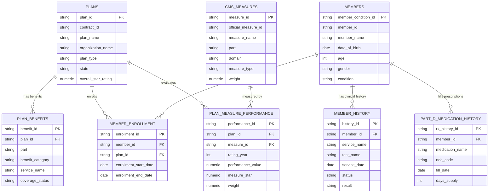
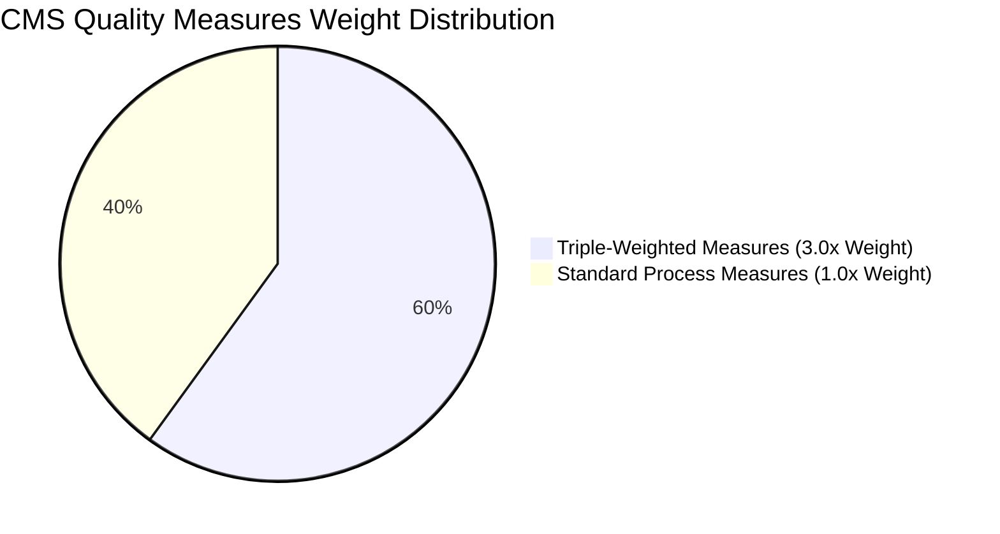
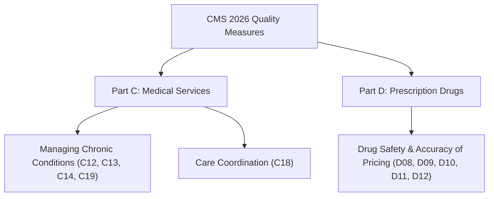
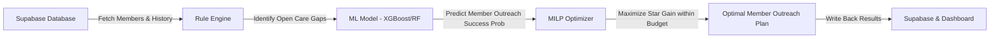

# 🗄️ Supabase Database Schema, CMS Star Measures & Analytics Reference


---

## 1. Executive Summary

This document provides a comprehensive technical reference for the **Medicare Advantage CMS Star Rating Optimization System**. It covers:
- **Full Database Schema** (8 Supabase PostgreSQL tables, ~35,000+ total rows)
- **Primary & Foreign Key Relationships** (ERD & relational data mapping)
- **10 CMS Quality Measures Specification** (Part C vs. Part D, weights, clinical rules, and optimization roles)
- **Aggregations & Groupings** (Members by Plan, Plan Performance, Care Gaps, Domain Weights)
- **Optimization Pipeline Flow** (Rule Engine ➔ ML Model ➔ MILP Optimizer ➔ Database Sync)

---

## 2. Database Entity-Relationship Diagram (ERD)



---

## 3. Database Table Specifications & Metrics

| # | Table Name | Rows Count | Primary Key | Foreign Key References | Purpose & Description |
|---|---|---|---|---|---|
| 1 | `plans` | **5** | `plan_id` | *None* | Health Plan Contract details (HMO/PPO), parent orgs, and overall star ratings. |
| 2 | `plan_benefits` | **34** | `benefit_id` | `plan_id ➔ plans.plan_id` | Benefit package rules, copays, coverage status, and frequency limits by plan. |
| 3 | `members` | **7,815** | `member_condition_id` | *None* | Demographics, medical conditions (Hypertension, Diabetes, CVD), age, and gender. |
| 4 | `member_enrollment` | **7,312** | `enrollment_id` | `member_id ➔ members.member_id`, `plan_id ➔ plans.plan_id` | Active enrollment records linking beneficiaries to specific health plans. |
| 5 | `member_history` | **4,555** | `history_id` | `member_id ➔ members.member_id` | Clinical encounters, lab test results (HbA1c, uACR, BP), and past outreach outcomes. |
| 6 | `cms_measures` | **10** | `measure_id` | *None* | Official CMS Quality Measures definitions, weights, numerator/denominator rules. |
| 7 | `plan_measure_performance` | **43** | `performance_id` | `plan_id ➔ plans.plan_id`, `measure_id ➔ cms_measures.measure_id` | Historical & current performance scores and star ratings per measure per plan. |
| 8 | `part_d_medication_history` | **7,943** | `rx_history_id` | `member_id ➔ members.member_id` | Pharmacy claims, NDC codes, fill dates, and PDC (Proportion of Days Covered) for Part D. |

---

## 4. CMS Star Rating Quality Measures Reference

CMS measures are divided into **Part C (Medical)** and **Part D (Prescription)**. Measures with a weight of **3.0x** have triple the impact on overall Plan Star Ratings compared to standard **1.0x** process measures.



### Master Measure Catalog & Sorting Purpose

| Measure ID | Official ID | Measure Name | Part | Domain | Type | Weight | Clinical Purpose & Optimization Sorting Role |
|---|---|---|---|---|---|---|---|
| **C12** | C12 | Diabetes Care – Blood Sugar Controlled | Part C | Managing Chronic Conditions | Intermediate Outcome | **3.0x** | **High Priority**. Targets members with Diabetes needing HbA1c control (< 9.0%). High impact on Part C rating. |
| **C13** | C13 | Kidney Health Evaluation for Diabetes | Part C | Managing Chronic Conditions | Process Measure | **1.0x** | Tracks eGFR & uACR annual lab tests for diabetic patients to prevent renal failure. |
| **C14** | C14 | Controlling Blood Pressure | Part C | Managing Chronic Conditions | Intermediate Outcome | **3.0x** | **High Priority**. Targets members with Hypertension needing BP control (< 140/90 mmHg). |
| **C18** | C18 | Plan All-Cause Readmissions | Part C | Care Coordination | Outcome Measure | **3.0x** | **High Priority**. Risk-adjusted 30-day post-discharge hospital readmission prevention. |
| **C19** | C19 | Statin Therapy for Cardiovascular Disease | Part C | Managing Chronic Conditions | Process Measure | **1.0x** | Verifies statin prescription fills for members with clinical atherosclerotic CVD. |
| **D08** | D08 | Medication Adherence for Diabetes | Part D | Drug Safety & Pricing | Intermediate Outcome | **3.0x** | **Triple-Weighted**. Measures PDC ≥ 80% for diabetes medications (Metformin, Insulin, etc.). |
| **D09** | D09 | Medication Adherence for RAS Antagonists | Part D | Drug Safety & Pricing | Intermediate Outcome | **3.0x** | **Triple-Weighted**. Measures PDC ≥ 80% for ACEi/ARB hypertension medications. |
| **D10** | D10 | Medication Adherence for Statins | Part D | Drug Safety & Pricing | Intermediate Outcome | **3.0x** | **Triple-Weighted**. Measures PDC ≥ 80% for cholesterol statin medications. |
| **D11** | D11 | MTM Program Completion Rate for CMR | Part D | Drug Safety & Pricing | Process Measure | **1.0x** | Tracks Comprehensive Medication Reviews (CMR) completed for high-risk MTM enrollees. |
| **D12** | D12 | Statin Use in Persons with Diabetes (SUPD) | Part D | Drug Safety & Pricing | Process Measure | **1.0x** | Ensures diabetic beneficiaries aged 40–75 receive at least one statin fill. |

---

## 5. Groupings & Data Analytics

### A. Member Distribution Grouped by Plan

```mermaid
gantt
    title Member Distribution by Plan
    dateFormat X
    axisFormat %s
    section Plan P001 (217 Members) : 0, 217
    section Plan P003 (213 Members) : 0, 213
    section Plan P002 (206 Members) : 0, 206
    section Plan P004 (201 Members) : 0, 201
    section Plan P005 (163 Members) : 0, 163
```

| Plan ID | Plan Name | Organization | State | Enrolled Members | Avg Measure Star Rating |
|---|---|---|---|---|---|
| **P001** | Horizon Senior Care HMO | Horizon Healthcare | CA | **217** | **3.50 ★** |
| **P002** | Sunshine Choice PPO | Sunshine Health | FL | **206** | **3.25 ★** |
| **P003** | Empire Gold Senior Plan | Empire Health | NY | **213** | **3.56 ★** |
| **P004** | Keystone Premier Care | Keystone Health | PA | **201** | **3.44 ★** |
| **P005** | Lone Star Advantage | Lone Star Care | TX | **163** | **3.44 ★** |

---

### B. Measures Grouped by CMS Domain & Part



---

## 6. How the System Uses Database Tables & Measures to Optimize Ratings



1. **Step 1 — Gap Identification (Rule Engine):** Combines `members`, `member_history`, `member_enrollment`, and `part_d_medication_history` to find members missing required tests or refills.
2. **Step 2 — Impact Weighting (CMS Measures):** Maps each open gap to its `cms_measures` record. Gaps attached to 3.0x weighted measures (like `C12`, `C14`, `D08`, `D09`, `D10`) receive 3x higher priority in scoring.
3. **Step 3 — Outreach Success Prediction (Machine Learning):** Random Forest & XGBoost models predict the probability ($P_{success}$) that a specific member will close their care gap given their history and demographics.
4. **Step 4 — Mixed Integer Linear Programming (MILP):** The optimizer sorts and selects the exact optimal subset of members to contact to maximize overall Plan Star Rating increase under outreach capacity constraints ($N_{max}$).
