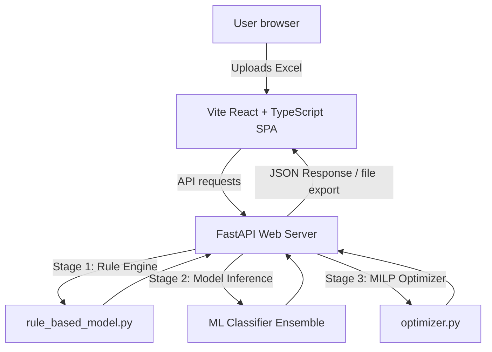

# Walkthrough - Metric Shift Star Rating Optimizer Web Application

This document summarizes the architecture, design implementation, API service contracts, and end-to-end verification results of the **MA Star Optimizer (Care Gap Intelligence)** analytics platform.

---

## 1. System Architecture

The application is structured into a clean, decoupled client-server architecture:

### Backend API Server (`server_api.py`)
- Built using **FastAPI** and served with **Uvicorn** on port 8000.
- Implements background worker threads to execute the three clinical optimization pipeline stages sequentially in-memory without polluting disk storage.
- Stores running job results securely as session objects.

### Frontend Application (`frontend/`)
- Scaffolded using **Vite + React + TypeScript**.
- Styled using a custom-designed **Vanilla CSS system** (using HSL/HEX variables) configured inside [index.css](file:///D:/Studies/College/Cognizant Project Main/frontend/src/index.css).
- Utilizes **Recharts** for premium, interactive SVG data charts (Bar, Area, and Pie).
- Features client routing mapped using **react-router-dom** HashRouter to handle deep-linking and state preservation.

---

## 2. API Service Contracts

The frontend utilizes a centralized client module located at [client.ts](file:///D:/Studies/College/Cognizant%20Project%20Main/frontend/src/api/client.ts) to communicate with these backend endpoints:

| Feature / UI Page | Endpoint | Method | Request Format | Response Format |
| :--- | :--- | :--- | :--- | :--- |
| **Excel Upload** | `/api/upload` | `POST` | `multipart/form-data` | `{"job_id": str, "status": str}` |
| **Pipeline Status** | `/api/pipeline/{job_id}` | `GET` | *URL Params* | `PipelineJob` checklist state |
| **Home Dashboard** | `/api/dashboard/{job_id}` | `GET` | `?plan_id={str}` | Summary counts + chart datasets |
| **Plan Profiles** | `/api/plans/{job_id}/{plan_id}` | `GET` | *URL Params* | Gaps distribution + rating trends |
| **Members Directory** | `/api/members/{job_id}` | `GET` | `?page={int}&limit={10}&search={str}` | Paginated list of patient records |
| **Member Details** | `/api/members/{job_id}/{member_id}`| `GET` | *URL Params* | Priority scores + detailed care gaps |
| **CMS Measures** | `/api/measures/{job_id}` | `GET` | *URL Params* | Registry of CMS parts, domains, & weights |
| **Outreach Optimization**| `/api/optimize/{job_id}` | `POST` | `application/x-www-form-urlencoded` | MILP selected list of outreach members |
| **CSV Exporter** | `/api/download/{job_id}` | `GET` | *URL Params* | Raw CSV file download response |
| **Geographic Map** | `/api/location/{job_id}` | `GET` | *URL Params* | Plan coverage & resolution rate by state |

---

## 3. Visual Interface & Design Details

- **White/Light Analytics Layout:** White clean cards, subtle gray borders, and soft shadows.
- **Dark Navy Sidebar:** Provides a structured navigation menu: *Home*, *Optimization*, *Plans*, *Members*, and *CMS Measure*. (Removed "Location" and "Upload Dataset" from the sidebar menu to match user instructions).
- **Responsive Sidebar Toggle (Hamburger Menu):** A menu icon button next to the title in the header toggles the sidebar, expanding the main clinical workspace area dynamically for larger screen space.
- **Global Header Upload Trigger:** An Upload button is placed in the top-right header before the search input (replacing the notification bell). Selecting an Excel spreadsheet initiates background execution and redirects the workspace to the pipeline checklist screen.
- **Home Content Upload Trigger:** A prominent Upload Dataset button is available in the top-right corner of the Home Page clinical workspace to easily import new datasets.
- **Dynamic Gradation Pipeline Loader:** Shows real-time spinner animations on the active step and transitions to a green checkmark upon completion.
- **Pipeline Completion Summary Card:** Prints the total active plans, enrolled members, open gaps, and CMS measures immediately upon processing completion.
- **2-Line Optimized Outreach Table:** Fits estimated star improvement, recommended interventions, and friendly clinical names.

---

## 4. End-to-End Test Verification

The application workflow has been verified end-to-end using automated browser subagents. The recording verifies:
1. Navigating to the pipeline checklist using `job_id: c1bbde49-7f3a-475b-8bc6-c63160110d77` (uploaded using `FILTERED_8_TABLES_UPDATED.xlsx`).
2. Monitoring the dynamic checkmark loader and verified the final metrics summary card.
3. Collapsing and expanding the navigation sidebar using the new hamburger menu toggle.
4. Accessing the global header upload button and home page upload button.
5. Verifying that the sidebar menu is simplified (no Location or Upload links).
6. Testing plans, CMS measures, optimization budgets, and member profile details.

### E2E Test Run Demonstration Video:

*(Click link above to play the WebP recording if it is not rendered natively)*

### Metric Shift Logo Verification:

*(Official logo integrated cleanly in the sidebar and matching page headers with a single global upload button)*
